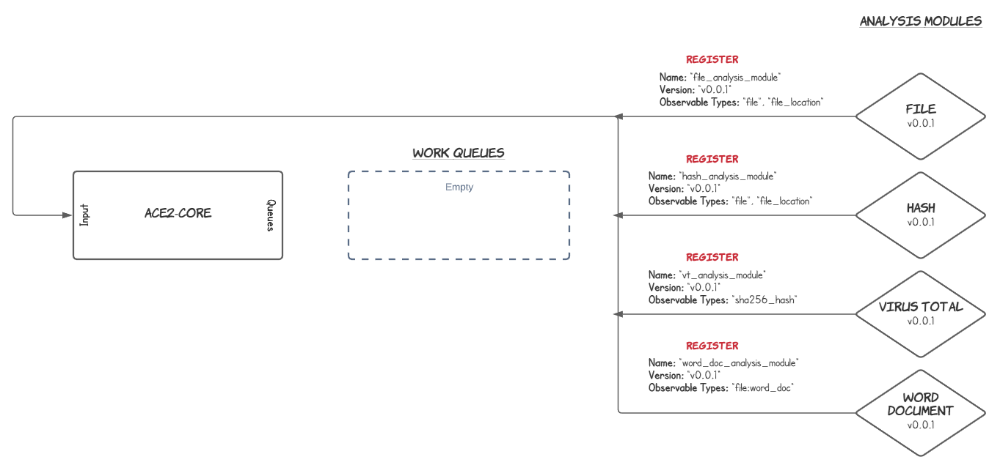
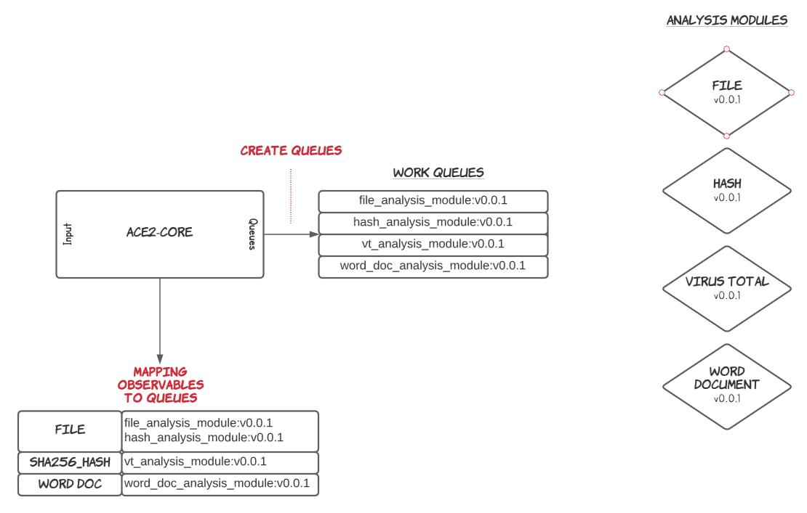
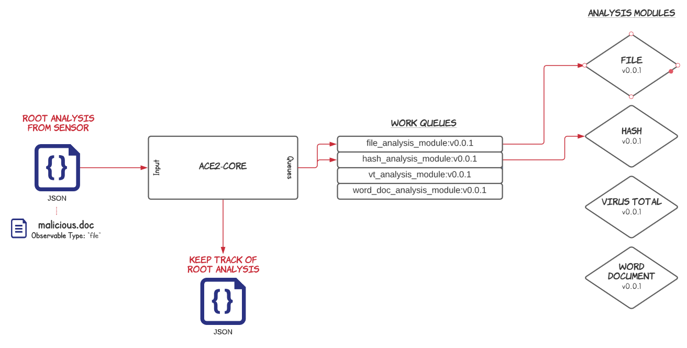
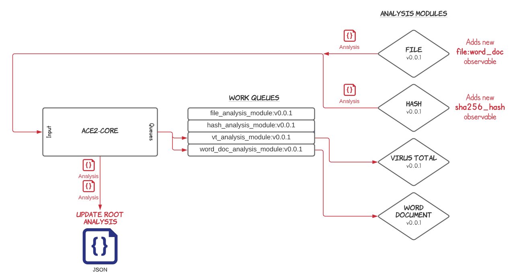
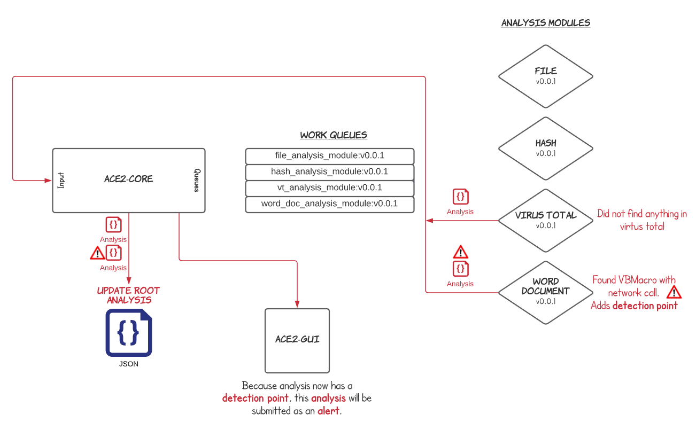

# Example Flow

Let's follow a simple example to show how an [alert](../design/alerts.md) can be generated by being analyzed by ace.

In this example we register analysis modules specifically to look for malicious word documents.
Then we assume a sensor submits a word document for analysis.

## Register Analysis Modules

[Analysis modules](../design/analysis_module.md) process [observables](../design/observable.md) to see if an
[alert](../design/alerts.md) should be created.

In this example we register four analysis modules:

- **File Type** analysis module
    - Accepts "_file_" observable types and outputs the type of file. For example: PDF, Word Document,
      Email, etc.
- **File Hash** analysis module
    - Accepts "_file_" observable types and outputs the hash of the file.
- **Virus Total** analysis module
    - Accepts "_sha256_hash_" observable types and outputs if the file has been identified as malicious or not.
    - May also add observables like file names, etc.
- **Word Document** analysis module
    - Accepts "_file:word_doc_" observables and outputs if the word doc is malicious.
    - May also add observables like URLs from within the document, screenshots of the document content, etc.

## Analysis Module Queues and Mapping

Ace receives the registration requests from the analysis modules and creates a queue dedicated to each.

## Analysis Submission

A sensor submits a [root analysis](../design/root_analysis.md) which contains an observable with type "_file_".

Ace keeps track of the root analysis and add analysis module results throughout the lifetime of the root analysis.

Ace then creates _observable analysis requests_ for each observable within the root analysis and places them in the appropriate queue(s) for analysis modules that accept "_file_" observable types. In this case, we only have one observable.

## Handling Analysis Module Results

The File Type and File Hash analysis modules receives the analysis request through the queues and then post their analysis results back to ace. These results
 may include things like [tags](../design/tags.md), [directives](../design/directives.md), 
[detection points](../design/detection_points.md), more observables, etc.

Ace adds the analysis results to the root analysis, and then places any additional observables discovered by the analysis
modules into the appropriate queue(s) for further analysis.

## An Alert Is Born

After this round of analysis Virus Total does not show any results related to the "_sha256_hash_" observable type.
However, the word document found a Visual Basic macro that contained a function known to make network calls. This
is suspicious and worth being presented to a security analyst.

The Word Document analysis module adds a detection point to note that it has detected something that should be
manually reviewed by an analyst.

Once the analysis is submitted back to ace, ace adds the analysis to the root analysis object. Ace sees there is ia detection point and will submit the root analysis as an alert.

